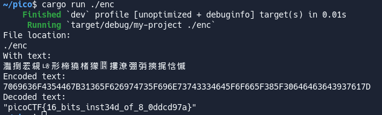

## What's `enc`
 <br>

# Test encoding function
### first.rs

From String to Integer. <br>
```
7069636F4354467B31365F626974735F696E73743334645F6F665F385F30646463643937617D
```
# Decoded Text
 <br>
```
picoCTF{16_bits_inst34d_of_8_0ddcd97a}
```

---

# References
- This is the challenge of [PicoCTF - Transformation](https://play.picoctf.org/practice/challenge/104?category=3&page=1)
- Practice with this [walkthrough](https://medium.com/@andrewss112/picoctf-write-up-transformation-7d458148e802) by 
Ross Andrews, 2023.