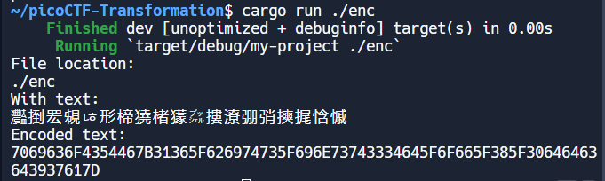
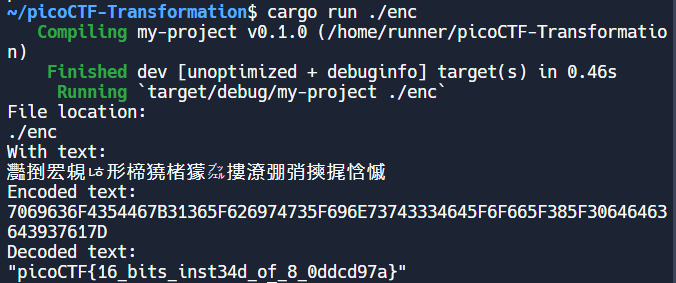

- This is the challenge [here](https://play.picoctf.org/practice/challenge/104?category=3&page=1)
- Practice with this [walkthrough](https://medium.com/@andrewss112/picoctf-write-up-transformation-7d458148e802)

---

# Test encoding function
### first.rs

# Decoded Text
### second.rs
