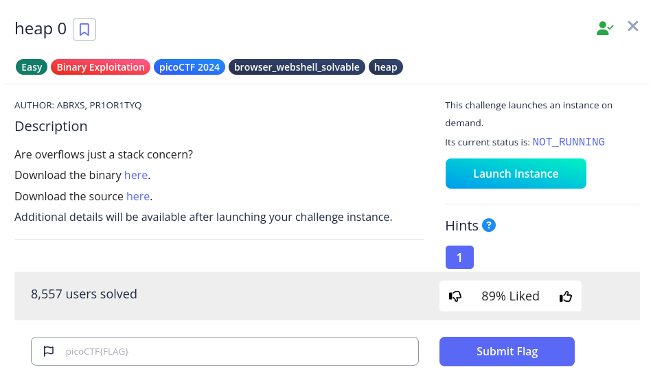
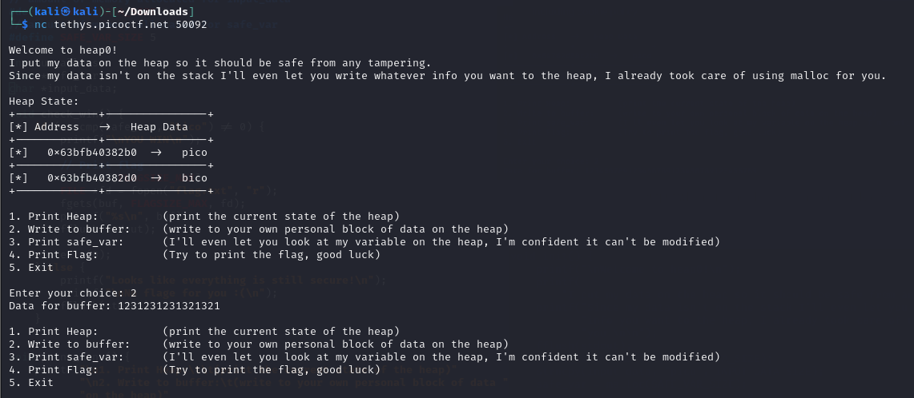
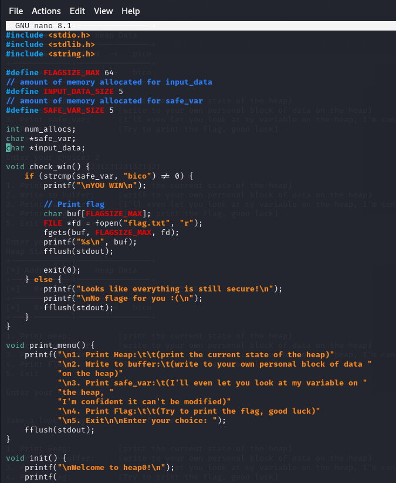
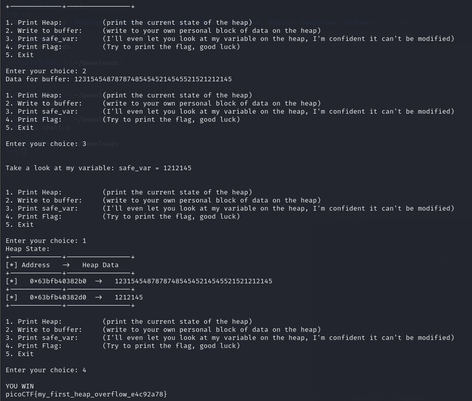

# Launch the instance
- Use kali
- Connect to the instance with the command below:
```
nc tethys.picoctf.net 50092
```
 <br>

# Step 1. Check the Instance
Check the menu and `chall.c`. <br>
 <br>
 <br>

# Step 2. Overflow in heap
 <br>
```
picoCTF{my_first_heap_overflow_e4c92a78}
```